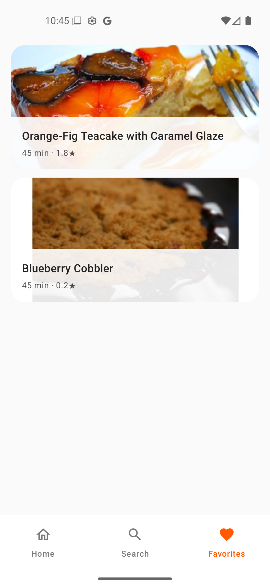

# RecipeApp

RecipeApp is a Kotlin Multiplatform app that showcases recipes from the Spoonacular API using a shared UI with Compose Multiplatform for Android and iOS.

## Features

- Home with featured and popular recipes
- Search by text (debounced) and quick chips
- Recipe details
- Favorites with local persistence
- Snackbar-based error handling
- Image loading with placeholders and loading indicators
- Dark Mode support on both Android and iOS

## Tech Stack

- Kotlin Multiplatform (KMP)
- Compose Multiplatform
- Voyager (Navigation)
- Koin (Dependency Injection)
- Ktor (Networking)
- Coil 3 (Images)
- SQLDelight (Local storage)
- Coroutines + StateFlow/Flow

## Architecture

- MVI + Unidirectional Data Flow
- Contracts per screen: State, Intent, Effect
- Shared domain/data layers across platforms

## Project Structure

- `composeApp/src/commonMain/` — Shared UI, ViewModels, use cases, repository
- `composeApp/src/androidMain/` — Android-specific
- `composeApp/src/iosMain/` — iOS-specific
- `iosApp/` — iOS launcher project
- `build.gradle.kts`, `settings.gradle.kts` — Build configuration
-

## Setup

### Prerequisites

- Android Studio or IntelliJ IDEA with Kotlin plugin
- JDK 11 or higher
- Xcode (for iOS development)
- Gradle 8.14.3 or higher

### Spoonacular API Key Configuration

This project uses **BuildKonfig** and **local.properties** to securely store API keys.

#### 1. Get Your Spoonacular API Key

1. Go to the [Spoonacular API](https://spoonacular.com/food-api) page
2. Create a free account
3. Copy your API key from the dashboard

#### 2. Add API Key to Local Properties

Add your API key to the `local.properties` file in the project root directory:

```properties

# API Keys - DO NOT COMMIT THIS FILE TO GIT! 
API_KEY=your_spoonacular_api_key_here
```

**Important:** The `local.properties` file is already in `.gitignore`, so it won't be committed to Git. This keeps your API key secure.

#### 3. Build the Project

Run the following command in the terminal:

```bash
./gradlew clean build
```

This command will run the BuildKonfig plugin and integrate the API key into your project.

#### 4. Usage

The API key is now automatically available in your code. It's accessed via BuildKonfig in `AppModule.kt`:

```kotlin
import org.example.recipeapp.BuildKonfig

val networkModule = module {
    single { createHttpClient() }
    single {
        SpoonacularApi(
            client = get(),
            apiKey = BuildKonfig.API_KEY // Automatically read from local.properties
        )
    }
}
```

### 🔒 Security Notes

- The `local.properties` file is in `.gitignore`, so it won't be committed to Git
- Each developer should create their own `local.properties` file
- Never write your API key directly into code files

### 🚀 Running the Project

#### Android

```bash
./gradlew :composeApp:assembleDebug
```

or open the project in Android Studio and press the Run button.

#### iOS

1. Open the `iosApp/iosApp.xcodeproj` file in Xcode
2. Select a simulator or physical device
3. Press the Run button

or in the terminal:

```bash
./gradlew :composeApp:iosSimulatorArm64Binaries.framework
```

## Screenshots

### Android

<table>
  <tr>
    <td align="center"><b>Home</b></td>
    <td align="center"><b>Search</b></td>
    <td align="center"><b>Favorites</b></td>
    <td align="center"><b>Details</b></td>
  </tr>
  <tr>
    <td></td>
    <td></td>
    <td></td>
    <td></td>
  </tr>
  
</table>

### iOS

<table>
  <tr>
    <td align="center"><b>Home</b></td>
    <td align="center"><b>Search</b></td>
    <td align="center"><b>Favorites</b></td>
    <td align="center"><b>Details</b></td>
  </tr>
  <tr>
    <td></td>
    <td></td>
    <td></td>
    <td></td>
  </tr>
</table>
